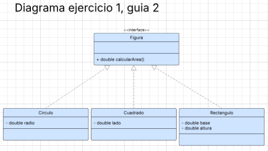

# Sea el siguiente código:

```java
public class Main {
    public static void main(String[] args) {
        List<Figura> figuras = new ArrayList<>();
        figuras.add(new Circulo(3));       // un circulo de radio 3
        figuras.add(new Cuadrado(5));      // un cuadrado de lado 5
        figuras.add(new Rectangulo(2, 4)); // un rectangulo de 2x4
        System.out.println("El area total es: %f", (areaTotal(figuras)));
    }

    private static double areaTotal(List<Figura> figuras) {
        double total = 0;
        for (Figura f : figuras) {
            total += f.area();
        }
        return total;
    }
}
```

# a) Pensar cuáles son las relaciones entre Figura, Circulo, Cuadrado y Rectangulo. ¿Figura debe ser una clase, una clase abstracta o una interfaz?
Figura debe ser una interfaz, la relacion entre circulo, cuadrado y rectangulo es que son Figuras, a las cuales se le puede calcular el area,
pero estas cuentan con diferentes atributos y por ende diferentes maneras de calcular el area

# b) ¿Dónde hay comportamiento polimórfico? ¿De qué tipo es?
El comportamiento polimorfico se ve al notar que el rectangulo, el circulo y el cuadrado se pueden tratar todos como una Figura, es decir,
su supertipo, siendo estas subtipos de esta clase (Figura)
El tipo es: Polimorfismo por inclusion o de subtipos

# c) Dibujar el diagrama de clases.


# d) Implementar